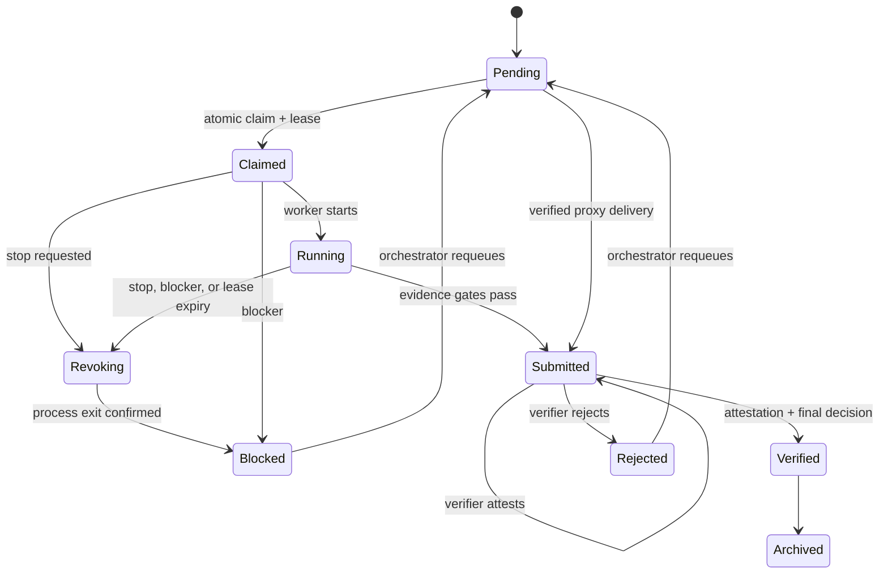

# Evidence First Orchestrator

Evidence First Orchestrator (EFO) is a local-first broker for coordinating
multiple coding agents without treating an agent's exit code or prose as proof
of completion.

It was designed for research and engineering work where Codex, Claude Code,
Antigravity, or another tool must share a project while preserving:

- single-owner task claims;
- capability-aware routing and per-agent concurrency limits;
- exclusive resource locks for repositories, datasets, and GPU indices;
- explicit file ownership;
- preregistered permissions and acceptance gates;
- raw validation evidence and artifact hashes;
- independent verification before a result becomes final;
- identity-aware independence across actor, controller, and model family;
- byte-exact proxy delivery for agents that cannot reach the broker;
- signed orchestrator handoff without rewriting workspace history;
- recovery after an agent, terminal, or machine stops;
- an append-only, hash-chained, HMAC-signed event history.

Workspace configuration, agent roles, and task projections are all checked
against signed ledger snapshots before authorization or state changes.

EFO has no runtime dependencies beyond Python 3.10 or newer.

## Why it exists

A Markdown inbox is useful coordination, but it cannot stop two workers from
claiming the same task, prove that a test was not skipped, or distinguish
"worker submitted a report" from "an independent verifier reproduced it."
EFO turns those rules into a state machine:



`SUBMITTED` is intentionally not `VERIFIED`. A different agent name is not
automatically independent: EFO can require different controller and model
family declarations as well.

## Quick start

From the repository:

```bash
python -m pip install -e .
efo init ./team-workspace \
  --name "Research team" \
  --preset meta-4-agent
```

The four-agent preset creates Codex, Claude A, Claude B, and Antigravity with
specialized capabilities. Antigravity's provider and model family deliberately
remain `unknown`; declare them with a signed `agent update` before relying on
strict independence.

The orchestrator creates a task. GPU, network, performance metrics, skipped
tests, and relaxed evidence gates are denied by default:

```bash
efo task add ./team-workspace \
  --actor antigravity \
  --id P1b-2 \
  --owner codex \
  --title "Implement significance-test utilities" \
  --description-file ./task.md \
  --allow-write /absolute/path/to/owned/module
```

A manual worker claims and starts it:

```bash
efo task claim ./team-workspace --actor codex --id P1b-2
efo task start ./team-workspace \
  --actor codex \
  --id P1b-2 \
  --lease-token "<token returned by claim>"
```

The worker writes its six-section report and evidence manifest under
`team-workspace/reports/codex/`, then submits:

```bash
efo task submit ./team-workspace \
  --actor codex \
  --id P1b-2 \
  --lease-token "<lease token>" \
  --report ./team-workspace/reports/codex/P1b-2.md \
  --evidence ./team-workspace/reports/codex/P1b-2.evidence.json
```

For this legacy-compatible task, the orchestrator reruns the checks and records
a separate manifest under its own report directory:

```bash
efo task verify ./team-workspace \
  --actor antigravity \
  --id P1b-2 \
  --decision accept \
  --note "Independent known-answer tests reproduced." \
  --evidence ./team-workspace/reports/antigravity/P1b-2.verify.evidence.json
```

## Meta-agent teams

Register durable identity and capability profiles instead of encoding roles
only in prompts:

```bash
efo agent add ./team-workspace \
  --actor antigravity \
  --id claude-a \
  --role worker \
  --controller-id claude-a \
  --provider anthropic \
  --model-family claude-code \
  --capability code \
  --capability implementation

efo agent add ./team-workspace \
  --actor antigravity \
  --id claude-b \
  --role verifier \
  --controller-id claude-b \
  --provider anthropic \
  --model-family claude-code \
  --capability adversarial-review \
  --capability verify
```

Two Claude Code processes can provide useful implementation/review separation,
but they do not satisfy a policy that requires a different `model_family`.
Codex and Claude Code can satisfy that dimension when their controller
identities also differ.

Tasks can preregister routing and exclusion rules:

```bash
efo task add ./team-workspace \
  --actor antigravity \
  --id SAFE-1 \
  --owner claude-a \
  --title "Implement a bounded change" \
  --description-file ./task.md \
  --requires-capability implementation \
  --resource-lock repo:cts \
  --verifier codex \
  --required-attestations 0 \
  --independence-dimension actor \
  --independence-dimension controller \
  --independence-dimension model_family

efo task verify ./team-workspace \
  --actor codex \
  --id SAFE-1 \
  --decision accept \
  --note "Known-answer tests reproduced independently." \
  --evidence ./team-workspace/reports/codex/SAFE-1.verify.evidence.json
```

`required_attestations` counts additional pre-finalization reviewers. The final
verifier cannot reuse its own attestation to fill that quorum and always
supplies a separate finalizer evidence manifest. Leave the count at zero when
only one cross-model verifier is available.

Transfer meta-orchestration only through a signed handoff:

```bash
efo workspace transfer-orchestrator ./team-workspace \
  --actor antigravity \
  --to codex \
  --reason "User appointed Codex as meta-orchestrator."
```

See [Meta-Orchestration v2](docs/META_ORCHESTRATION_V2.md) for the recommended
Codex, Claude A, Claude B, and Antigravity operating model.

## Offline workers and proxy delivery

If a cloud worker cannot reach the broker, the current orchestrator may submit
its Git delivery without impersonating it. The signed record keeps `author`
and `submitted_by` separate, and those identities must differ. Each delivered
file is read with `git cat-file`
and compared byte-for-byte with the local artifact, detecting CRLF conversion.
Before accepting bytes, EFO also asks the configured remote which commit its
preregistered branch currently advertises. The expected remote name, URL,
full `refs/heads/...` ref, and complete source-file scope must be fixed when
the task is created:

```bash
efo task add ./team-workspace \
  --actor antigravity \
  --id C1 \
  --owner claude-a \
  --title "Offline Git delivery" \
  --description-file ./C1.md \
  --allow-proxy-delivery \
  --proxy-remote-name origin \
  --proxy-remote-url https://github.com/example/project.git \
  --proxy-ref refs/heads/claude/C1 \
  --proxy-repo-path file.py

efo task proxy-submit ./team-workspace \
  --actor antigravity \
  --id C1 \
  --author claude-a \
  --report ./team-workspace/reports/antigravity/C1.md \
  --evidence ./team-workspace/reports/antigravity/C1.evidence.json \
  --source-repo /path/to/fetched/repository \
  --source-commit FULL_40_CHARACTER_COMMIT_SHA \
  --source-files-json '[{"local_path":"/tmp/file.py","repo_path":"file.py"}]'
```

`proxy-submit` performs a bounded `git ls-remote` check and therefore needs
network and credentials for the preregistered remote. A local-only commit is
rejected even if it exists in the source clone.

## Command adapters

Manual mode works with any agent that can read and write files. Command mode
also launches a non-interactive agent CLI without using a shell:

```bash
efo agent add ./team-workspace \
  --actor antigravity \
  --id worker3 \
  --mode command \
  --command-json '["agent-cli","--prompt-file","{prompt}"]'

efo worker loop ./team-workspace \
  --agent worker3 \
  --poll-seconds 5
```

Available placeholders are:

| Placeholder | Meaning |
|---|---|
| `{workspace}` | Broker workspace |
| `{task_id}` | Claimed task ID |
| `{task_file}` | Task JSON projection |
| `{prompt}` | Generated self-contained task prompt |
| `{report}` | Required Markdown report path |
| `{evidence}` | Required evidence manifest path |

Use the actual non-interactive syntax supported by the installed agent CLI.
EFO does not guess a vendor's flags.

For a CLI such as Claude Code that accepts piped context rather than a
`--prompt-file` option, configure an existing signed profile without recreating
its identity:

```bash
efo agent delivery ./team-workspace \
  --actor antigravity \
  --id claude-a \
  --mode command \
  --prompt-stdin \
  --command-json '[
    "claude",
    "-p",
    "Execute the complete EFO task supplied on stdin.",
    "--output-format",
    "text"
  ]'
```

The delivery update is rejected while that agent owns a claimed, running, or
revoking task. The generated prompt includes the signed actor and orchestrator
profiles and forbids the worker from assuming another identity.

The adapter:

1. atomically claims the task;
2. starts and heartbeats its lease;
3. runs the configured argument list with `shell=False`;
4. records stdout and stderr;
5. detects writes outside the agent's workspace ownership;
6. submits only if the evidence gates pass.

See [Automated Agent Delivery](docs/AUTOMATED_DELIVERY.md) for the no-copy/paste
Claude A/Claude B setup and its one-time authentication boundary.

## Evidence manifest

Every submission includes a JSON manifest:

```json
{
  "schema_version": 1,
  "artifacts": [
    {
      "path": "raw-test-output.txt",
      "sha256": "FULL_64_CHARACTER_SHA256"
    }
  ],
  "validations": [
    {
      "command": "python -m unittest discover -v",
      "exit_code": 0,
      "passed": 20,
      "failed": 0,
      "skipped": 0,
      "skip_reasons": [],
      "raw_output_path": "raw-test-output.txt",
      "raw_output_sha256": "FULL_64_CHARACTER_SHA256"
    }
  ],
  "known_answer_checks": [
    {
      "name": "exact small case",
      "expected": 16,
      "observed": 16,
      "passed": true
    }
  ],
  "claims": [
    {
      "name": "tool behavior",
      "kind": "functional",
      "measured": true,
      "value": "pass",
      "evidence": ["raw-test-output.txt"]
    },
    {
      "name": "benchmark accuracy",
      "kind": "performance",
      "measured": false,
      "value": "[FILL]",
      "evidence": []
    }
  ]
}
```

Default rejection conditions include:

- a missing report section;
- nonzero exit code or failed validation;
- a skipped check without preregistered permission;
- missing expected-versus-observed comparison;
- an artifact or raw output SHA mismatch;
- a measured performance claim when the task forbids it;
- an unmeasured value that is not exactly `[FILL]`;
- reuse of the worker's manifest as independent verification.
- an undeclared or matching controller/model family when the task requires
  those independence dimensions;
- a same-resource claim while another claimed, running, or submitted task
  holds that lock;
- a high/critical task without named actor/controller/model-family-independent
  verification;
- proxy-delivered bytes that differ from the declared Git blob;
- a proxy remote, ref, or source-file set not preregistered on the task;
- a local-only proxy commit not advertised by the preregistered remote branch.

## Dashboard

Run the read-only operational dashboard:

```bash
efo serve ./team-workspace
```

Open `http://127.0.0.1:8765`. Remote binding is rejected unless
`--allow-remote` is explicitly supplied.

## Recovery and audit

```bash
efo recover ./team-workspace --actor antigravity
efo ledger verify ./team-workspace
efo ledger audit-projections ./team-workspace
efo workspace fingerprint ./team-workspace
efo doctor ./team-workspace
efo audit independence ./team-workspace
efo task revoke ./team-workspace \
  --actor antigravity \
  --id STALE-LEASE \
  --reason "Owner was deactivated or lost required capability."
efo task confirm-revocation ./team-workspace \
  --actor antigravity \
  --id STALE-LEASE \
  --termination-evidence "PID and accelerator process inventories are empty."
efo task invalidate ./team-workspace \
  --actor antigravity \
  --id HISTORICAL-1 \
  --reason "Retrospective audit found a non-independent approval."
```

`workspace fingerprint` is read-only and binds the canonical path, host,
runtime, signed workspace ID, ledger SHA-256/head, agents, and tasks into one
JSON packet. Use it before an upgrade or provider authentication; a valid
signature proves the integrity of the ledger that was opened, not that the
operator opened the intended ledger.

An expired claimed task moves to `BLOCKED`; an expired running task moves to
`REVOKING` because its process may still be live. Neither is silently
requeued. Revocation continues to hold every resource lock. A command adapter
uses a gated supervisor plus a serialized Linux child subreaper or Windows Job
Object, and acknowledges only with its in-memory execution token after the
full tree stops. Linux descendants remain tracked across `setsid()` and
double-fork daemonization; non-Linux POSIX execution fails closed. The
acknowledgement is not exposed as a worker CLI command. A manual task
requires explicit orchestrator confirmation with external termination
evidence. Start, heartbeat, and submission recheck that the owner is active
and still has every required capability.

The event ledger is the source of truth. Task JSON files are projections that
can be reconstructed from signed events. Independence audit walks every
historical `task.verified` event, so invalidating and requeueing a task cannot
erase the old decision.

At submission, EFO copies the report, manifest, and evidence files up to 50 MB
into `submissions/<task>/<attempt>/`. Larger artifacts such as checkpoints stay
external; their absolute path, byte size, and SHA-256 remain in the signed
record. The size limit is stored in the workspace configuration.

## Existing Markdown workspaces

Audit an existing Antigravity/Codex/Claude workspace without modifying it:

```bash
efo legacy audit "E:\\path\\to\\shared-workspace"
```

The audit checks required files, event-line formatting, read access, and
secret-like plaintext values. A write test is opt-in and targets only the
selected agent's report directory:

```bash
efo legacy audit "E:\\path\\to\\shared-workspace" \
  --agent codex \
  --write-test
```

See [Migration Guide](docs/MIGRATION.md) for a staged adoption path.

## What EFO does not claim

- It cannot make direct filesystem edits safe if an agent bypasses EFO. Use
  containers or OS accounts/ACLs for hard isolation.
- It cannot invoke a proprietary agent that exposes no CLI, API, or file
  polling interface. That agent can still use manual mode.
- A local HMAC key detects accidental or unauthorized ledger edits by parties
  without the key. It is not a substitute for an external transparency log or
  hardware-backed signature.
- It does not decide scientific thresholds, statistical families, or benchmark
  protocols. Those must be preregistered by the project owner.
- It cannot prove that every natural-language claim was declared in the
  manifest. The independent verifier must compare the report against the claim
  list before acceptance.
- It never stores SSH passwords or API tokens in task files.

## Development

```bash
python -m unittest discover -s tests -t . -v
```

The suite covers state transitions, evidence gates, concurrent claims, resource
locks, model/controller independence, proxy-delivery attacks, CRLF mutation,
orchestrator transfer, lease recovery, command adapters, legacy auditing, and
ledger tamper detection.

See [Architecture](docs/ARCHITECTURE.md), [Security](SECURITY.md), and
[Contributing](CONTRIBUTING.md).

## License

Apache License 2.0.
