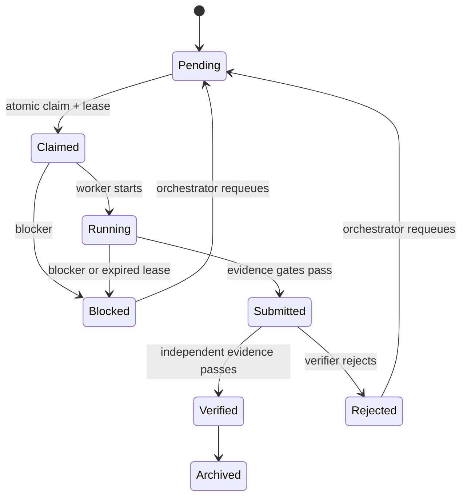

# Evidence First Orchestrator

Evidence First Orchestrator (EFO) is a local-first broker for coordinating
multiple coding agents without treating an agent's exit code or prose as proof
of completion.

It was designed for research and engineering work where Codex, Claude Code,
Antigravity, or another tool must share a project while preserving:

- single-owner task claims;
- explicit file ownership;
- preregistered permissions and acceptance gates;
- raw validation evidence and artifact hashes;
- independent verification before a result becomes final;
- recovery after an agent, terminal, or machine stops;
- an append-only, hash-chained, HMAC-signed event history.

Workspace configuration, agent roles, and task projections are all checked
against signed ledger snapshots before authorization or state changes.

EFO has no runtime dependencies beyond Python 3.10 or newer.

## Why it exists

A Markdown inbox is useful coordination, but it cannot stop two workers from
claiming the same task, prove that a test was not skipped, or distinguish
"worker submitted a report" from "an independent verifier reproduced it."
EFO turns those rules into a state machine:



`SUBMITTED` is intentionally not `VERIFIED`.

## Quick start

From the repository:

```bash
python -m pip install -e .
efo init ./team-workspace \
  --name "Research team" \
  --preset antigravity-codex-claude
```

The orchestrator creates a task. GPU, network, performance metrics, skipped
tests, and relaxed evidence gates are denied by default:

```bash
efo task add ./team-workspace \
  --actor antigravity \
  --id P1b-2 \
  --owner codex \
  --title "Implement significance-test utilities" \
  --description-file ./task.md \
  --allow-write /absolute/path/to/owned/module
```

A manual worker claims and starts it:

```bash
efo task claim ./team-workspace --actor codex --id P1b-2
efo task start ./team-workspace \
  --actor codex \
  --id P1b-2 \
  --lease-token "<token returned by claim>"
```

The worker writes its six-section report and evidence manifest under
`team-workspace/reports/codex/`, then submits:

```bash
efo task submit ./team-workspace \
  --actor codex \
  --id P1b-2 \
  --lease-token "<lease token>" \
  --report ./team-workspace/reports/codex/P1b-2.md \
  --evidence ./team-workspace/reports/codex/P1b-2.evidence.json
```

The orchestrator reruns the checks and records a separate manifest under its
own report directory:

```bash
efo task verify ./team-workspace \
  --actor antigravity \
  --id P1b-2 \
  --decision accept \
  --note "Independent known-answer tests reproduced." \
  --evidence ./team-workspace/reports/antigravity/P1b-2.verify.evidence.json
```

## Command adapters

Manual mode works with any agent that can read and write files. Command mode
also launches a non-interactive agent CLI without using a shell:

```bash
efo agent add ./team-workspace \
  --actor antigravity \
  --id worker3 \
  --mode command \
  --command-json '["agent-cli","--prompt-file","{prompt}"]'

efo worker loop ./team-workspace \
  --agent worker3 \
  --poll-seconds 5
```

Available placeholders are:

| Placeholder | Meaning |
|---|---|
| `{workspace}` | Broker workspace |
| `{task_id}` | Claimed task ID |
| `{task_file}` | Task JSON projection |
| `{prompt}` | Generated self-contained task prompt |
| `{report}` | Required Markdown report path |
| `{evidence}` | Required evidence manifest path |

Use the actual non-interactive syntax supported by the installed agent CLI.
EFO does not guess a vendor's flags.

The adapter:

1. atomically claims the task;
2. starts and heartbeats its lease;
3. runs the configured argument list with `shell=False`;
4. records stdout and stderr;
5. detects writes outside the agent's workspace ownership;
6. submits only if the evidence gates pass.

## Evidence manifest

Every submission includes a JSON manifest:

```json
{
  "schema_version": 1,
  "artifacts": [
    {
      "path": "raw-test-output.txt",
      "sha256": "FULL_64_CHARACTER_SHA256"
    }
  ],
  "validations": [
    {
      "command": "python -m unittest discover -v",
      "exit_code": 0,
      "passed": 20,
      "failed": 0,
      "skipped": 0,
      "skip_reasons": [],
      "raw_output_path": "raw-test-output.txt",
      "raw_output_sha256": "FULL_64_CHARACTER_SHA256"
    }
  ],
  "known_answer_checks": [
    {
      "name": "exact small case",
      "expected": 16,
      "observed": 16,
      "passed": true
    }
  ],
  "claims": [
    {
      "name": "tool behavior",
      "kind": "functional",
      "measured": true,
      "value": "pass",
      "evidence": ["raw-test-output.txt"]
    },
    {
      "name": "benchmark accuracy",
      "kind": "performance",
      "measured": false,
      "value": "[FILL]",
      "evidence": []
    }
  ]
}
```

Default rejection conditions include:

- a missing report section;
- nonzero exit code or failed validation;
- a skipped check without preregistered permission;
- missing expected-versus-observed comparison;
- an artifact or raw output SHA mismatch;
- a measured performance claim when the task forbids it;
- an unmeasured value that is not exactly `[FILL]`;
- reuse of the worker's manifest as independent verification.

## Dashboard

Run the read-only operational dashboard:

```bash
efo serve ./team-workspace
```

Open `http://127.0.0.1:8765`. Remote binding is rejected unless
`--allow-remote` is explicitly supplied.

### Cloudflare operations dashboard

The repository also includes a responsive, read-only operations dashboard in
`public/`. It combines:

- Codex, Claude A, Claude B, and Antigravity role and task state;
- EFO task transitions and signed-ledger health;
- physical GPU 0-N utilization, VRAM, temperature, power, and project mapping;
- host memory, disk, load, uptime, alerts, and rolling charts.

The SSH collector in `monitor/` only reads `nvidia-smi`, Docker status/logs,
procfs, and EFO JSON output. It never starts, stops, restarts, or allocates a
container or GPU. Public snapshots omit passwords, secrets, environment
variables, command lines, PIDs, and GPU UUIDs.

Cloudflare Pages deployment and collector installation are documented in
[Operations Dashboard](docs/OPERATIONS_DASHBOARD.md). Until the API is
configured, the page visibly identifies its bundled sample as `DEMO`; it never
passes sample data off as live telemetry.

## Recovery and audit

```bash
efo recover ./team-workspace --actor antigravity
efo ledger verify ./team-workspace
efo ledger audit-projections ./team-workspace
efo doctor ./team-workspace
```

An expired task moves to `BLOCKED`; it is never silently requeued. The
orchestrator must inspect and explicitly requeue it, preventing duplicate work
when a slow worker is still alive.

The event ledger is the source of truth. Task JSON files are projections that
can be reconstructed from signed events.

At submission, EFO copies the report, manifest, and evidence files up to 50 MB
into `submissions/<task>/<attempt>/`. Larger artifacts such as checkpoints stay
external; their absolute path, byte size, and SHA-256 remain in the signed
record. The size limit is stored in the workspace configuration.

## Existing Markdown workspaces

Audit an existing Antigravity/Codex/Claude workspace without modifying it:

```bash
efo legacy audit "E:\\path\\to\\shared-workspace"
```

The audit checks required files, event-line formatting, read access, and
secret-like plaintext values. A write test is opt-in and targets only the
selected agent's report directory:

```bash
efo legacy audit "E:\\path\\to\\shared-workspace" \
  --agent codex \
  --write-test
```

See [Migration Guide](docs/MIGRATION.md) for a staged adoption path.

## What EFO does not claim

- It cannot make direct filesystem edits safe if an agent bypasses EFO. Use
  containers or OS accounts/ACLs for hard isolation.
- It cannot invoke a proprietary agent that exposes no CLI, API, or file
  polling interface. That agent can still use manual mode.
- A local HMAC key detects accidental or unauthorized ledger edits by parties
  without the key. It is not a substitute for an external transparency log or
  hardware-backed signature.
- It does not decide scientific thresholds, statistical families, or benchmark
  protocols. Those must be preregistered by the project owner.
- It cannot prove that every natural-language claim was declared in the
  manifest. The independent verifier must compare the report against the claim
  list before acceptance.
- It never stores SSH passwords or API tokens in task files.

## Development

```bash
python -m unittest discover -s tests -t . -v
npm run test:web
```

The suite covers state transitions, evidence gates, concurrent claims, lease
recovery, command adapters, legacy auditing, ledger tamper detection, the
read-only server collector, and the signed Cloudflare ingest endpoint.

See [Architecture](docs/ARCHITECTURE.md), [Security](SECURITY.md), and
[Contributing](CONTRIBUTING.md).

## License

Apache License 2.0.
