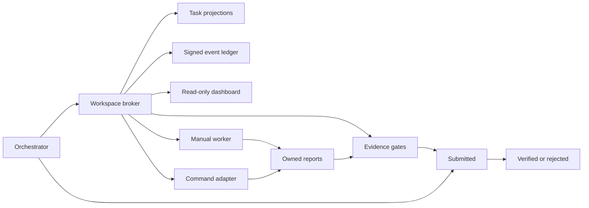

# Architecture

## Trust model

Evidence First Orchestrator is a local broker. It assumes:

- the orchestrator controls task creation and final verification;
- workers may be unreliable, interrupted, or mistaken;
- multiple workers may race for the same task;
- the filesystem may retain partial output after a crash;
- prose and process exit are not evidence by themselves.

Workers are not trusted to mark their own work verified.

## Components

### Workspace broker

`Workspace` enforces actor roles, legal transitions, prerequisites, ownership,
idempotency keys, and leases.

### Signed event ledger

Each JSONL event contains:

- a sequence number;
- UTC timestamp;
- actor and action;
- optional task ID;
- event payload, including the complete task snapshot;
- the previous event hash;
- its own SHA-256;
- an HMAC-SHA256 signature.

The private local key is stored at `.efo/ledger.key`. It is runtime state and
must never be committed. Before appending, the existing chain is verified.

The complete initial workspace configuration and every agent registration are
also signed events. Their JSON projections are compared to those events before
authorization decisions, so directly changing the orchestrator or a worker role
does not grant permissions.

### Task projections

`tasks/<id>.json` is a convenient current-state projection. The event stream is
authoritative. `ledger audit-projections` detects missing or altered
projections.

The broker writes the event before replacing the projection. If a process dies
between those operations, the complete task snapshot remains in the ledger and
the projection can be rebuilt.

### Locking and leases

Short transactions use atomic lock-file creation. A task claim is serialized by
its task lock, so concurrent workers cannot both claim it.

The longer-running lease is separate. Its token is returned once and only a
SHA-256 digest is stored. Heartbeats extend the expiration. Expired work becomes
blocked, requiring an orchestrator decision before another attempt.

### Evidence gates

Human reports must have six numbered sections. Machine-readable manifests bind
artifacts and raw output to SHA-256 values, record exact pass/fail/skip counts,
and declare claims as measured or unmeasured.

Task permissions and gates are captured when the task is created. A worker
cannot relax them during submission.

### Independent verification

A worker can only reach `submitted`. The orchestrator must provide a separate
verification manifest from its own report directory. Reusing the worker
manifest is rejected.

### Evidence retention

Reports and manifests are always copied into an attempt-specific submission
bundle. Artifacts and raw outputs are copied when they are no larger than the
workspace retention limit. Larger files remain external and are bound by path,
size, and SHA-256. A source file is hashed again after copying, so mutation
between validation and archival rejects the submission.

## Failure boundaries

| Failure | Behavior |
|---|---|
| Two simultaneous claims | One atomic claim succeeds |
| Worker process crashes | Lease eventually expires to blocked |
| Test skips | Submission rejected unless preregistered |
| Report lacks evidence | Submission rejected |
| Task JSON is lost | Ledger retains complete snapshot |
| Ledger line is edited | Hash or HMAC verification fails |
| Agent writes another workspace area | Command adapter reports and blocks |
| Agent bypasses the broker | Detectable in some cases, not preventable without OS isolation |

## Hard isolation

EFO provides application-level policy. For adversarial or high-risk workers,
run each adapter in a container or separate OS account and mount only its
allowed paths. The EFO report and run directories then become the exchange
surface.
