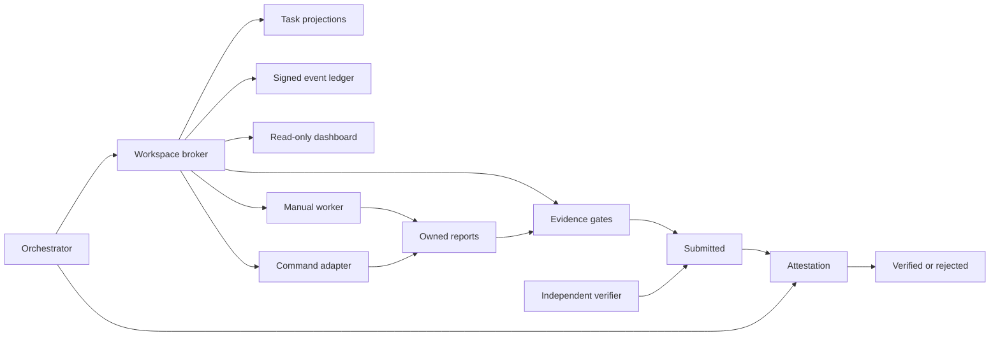

# Architecture

## Trust model

Evidence First Orchestrator is a local broker. It assumes:

- the orchestrator controls task creation and final adjudication;
- an authorized independent verifier may finalize orchestrator-authored work;
- workers may be unreliable, interrupted, or mistaken;
- multiple workers may race for the same task;
- the filesystem may retain partial output after a crash;
- prose and process exit are not evidence by themselves.

Workers are not trusted to mark their own work verified. Independence is
evaluated from signed actor, controller, and model-family declarations rather
than from display names alone.

## Components

### Workspace broker

`Workspace` enforces actor roles, legal transitions, prerequisites, ownership,
idempotency keys, leases, capabilities, concurrency ceilings, exclusive
resource locks, signed authority transfer, and verifier independence.

### Signed event ledger

Each JSONL event contains:

- a sequence number;
- UTC timestamp;
- actor and action;
- optional task ID;
- event payload, including the complete task snapshot;
- the previous event hash;
- its own SHA-256;
- an HMAC-SHA256 signature.

The private local key is stored at `.efo/ledger.key`. It is runtime state and
must never be committed. Before appending, the existing chain is verified.

The complete initial workspace configuration and every agent registration are
also signed events. Their JSON projections are compared to those events before
authorization decisions, so directly changing the orchestrator or a worker role
does not grant permissions.

Agent profile updates and orchestrator transfers are additive ledger events.
During a transfer, both old and new orchestrator projections receive a signed
governance epoch before authority changes. A v0.1 binary ignores the new event
kind but then rejects the updated agent projection, failing closed instead of
silently granting the former orchestrator continued authority.
Orchestrator-only events also recheck effective authority while holding the
ledger lock, so a command racing with the handoff cannot commit under stale
authority.

### Task projections

`tasks/<id>.json` is a convenient current-state projection. The event stream is
authoritative. `ledger audit-projections` detects missing or altered
projections.

The broker writes the event before replacing the projection. If a process dies
between those operations, the complete task snapshot remains in the ledger and
the projection can be rebuilt.

### Locking and leases

Short transactions use atomic lock-file creation. A task claim is serialized by
its task lock, so concurrent workers cannot both claim it. A workspace resource
lock serializes the cross-task conflict check, preventing two different tasks
from simultaneously acquiring the same declared resource. A resource remains
held while its task is `submitted`; verification or rejection releases it.
Claim also rereads the signed agent profile under the agent lock, preventing a
concurrent deactivation or capability withdrawal from being bypassed.

The longer-running lease is separate. Its token is returned once and only a
SHA-256 digest is stored. Heartbeats extend the expiration. An expired claimed
task becomes blocked. An expired running task becomes `revoking` and retains
its resource locks until process termination is externally confirmed.

Command adapters launch a gated supervisor. The supervisor is assigned to a
POSIX process group or a kill-on-close Windows Job Object before the worker
command starts. A second random execution token is hashed into the signed task
projection and retained only by the adapter. It is required for the internal
termination acknowledgement and is deliberately absent from the worker CLI
and worker environment.

### Evidence gates

Human reports must have six numbered sections. Machine-readable manifests bind
artifacts and raw output to SHA-256 values, record exact pass/fail/skip counts,
and declare claims as measured or unmeasured.

Task permissions and gates are captured when the task is created. A worker
cannot relax them during submission.

High and critical risk tasks are rejected at creation unless validation,
known-answer, zero-skip, and independent-verification gates are enabled; all
three identity dimensions are required; and at least one named independent
verifier is available. Attestation policies are checked for a feasible
attester-plus-distinct-finalizer quorum before the task enters the ledger.

### Independent verification

A worker can only reach `submitted`. An authorized verifier records an
accepting or rejecting attestation with a separate evidence manifest. The
broker checks every independence dimension preregistered by the task. Matching
controller or model family is rejected when those dimensions are required.
The author identity is frozen into the signed submission, so a later profile
update cannot manufacture independence. Reusing the worker manifest is always
rejected.

The final decision can be recorded by the current orchestrator or an authorized
verifier, but an accepting finalizer must itself satisfy the independence
policy and cannot count its own earlier attestation toward the preregistered
quorum. Every accepting finalizer also supplies a separate evidence manifest.
This permits an independent verifier to finalize work authored by the
orchestrator without creating a self-approval path.

### Proxy delivery

An unreachable worker can deliver through Git. Only the current orchestrator
may invoke `proxy-submit`, and the declared author must equal the task owner.
The proxy and author must be distinct identities, and the ledger records both.
Each delivered file is compared
byte-for-byte against `git cat-file blob <commit>:<path>` and must also appear
in the evidence manifest. The task preregisters the remote name, URL, full
branch ref, and complete repository-path set. A bounded `git ls-remote` request
must show that the remote advertises the submitted SHA at that exact branch.
Proxy submission must match every field and pass the same capability,
concurrency, and resource-conflict checks as a normal claim. These checks catch
local-only commits, wrong-source delivery, partial-scope delivery, CRLF
conversion, and archive mutation.

### Historical independence audit

Independence audit reads every signed `task.verified` event rather than only the
latest task projection. It joins invalidation by task ID and attempt, preserving
old findings after requeue. Missing event-time identity is `inconclusive`;
later declarations may conservatively prove a match but cannot retroactively
prove independence. Both non-independent and inconclusive, non-quarantined
records make `doctor` unhealthy.

### Evidence retention

Reports and manifests are always copied into an attempt-specific submission
bundle. Artifacts and raw outputs are copied when they are no larger than the
workspace retention limit. Larger files remain external and are bound by path,
size, and SHA-256. A source file is hashed again after copying, so mutation
between validation and archival rejects the submission.

## Failure boundaries

| Failure | Behavior |
|---|---|
| Two simultaneous claims | One atomic claim succeeds |
| Different tasks request one resource | The lock remains exclusive through submission or pending revocation |
| Worker process crashes before start | Claimed lease eventually expires to blocked |
| Running worker stops heartbeating | Lease expires to `revoking`; locks remain until termination confirmation |
| Worker parent exits but leaves descendants | Windows Job Object or Linux subreaper terminates the tracked tree and blocks the task |
| Linux descendant calls `setsid()` or double-forks | Serialized subreaper tracking retains attribution; unconfirmed cleanup disables the broker |
| Non-Linux POSIX command adapter requested | Launch fails closed because equivalent descendant tracking is unavailable |
| Owner is deactivated or loses a capability | Start/heartbeat/submit fail; revocation holds locks until termination confirmation |
| Worker is offline from the broker | Proxy enforces preregistered source and normal conflicts |
| Alias verifies its controller's work | Controller independence rejects it |
| Same-model reviewer shares the blind spot | Model-family independence rejects it |
| Orchestrator verifies its own work | Independent finalizer requirement rejects it |
| Git transport changes line endings | Byte-to-blob check rejects it |
| Proxy commit exists only locally | Remote advertisement check rejects it |
| Test skips | Submission rejected unless preregistered |
| Report lacks evidence | Submission rejected |
| Task JSON is lost | Ledger retains complete snapshot |
| Ledger line is edited | Hash or HMAC verification fails |
| Agent writes another workspace area | Command adapter reports and blocks |
| Agent bypasses the broker | Detectable in some cases, not preventable without OS isolation |

## Hard isolation

EFO provides application-level policy. For adversarial or high-risk workers,
run each adapter in a container or separate OS account and mount only its
allowed paths. The EFO report and run directories then become the exchange
surface.
